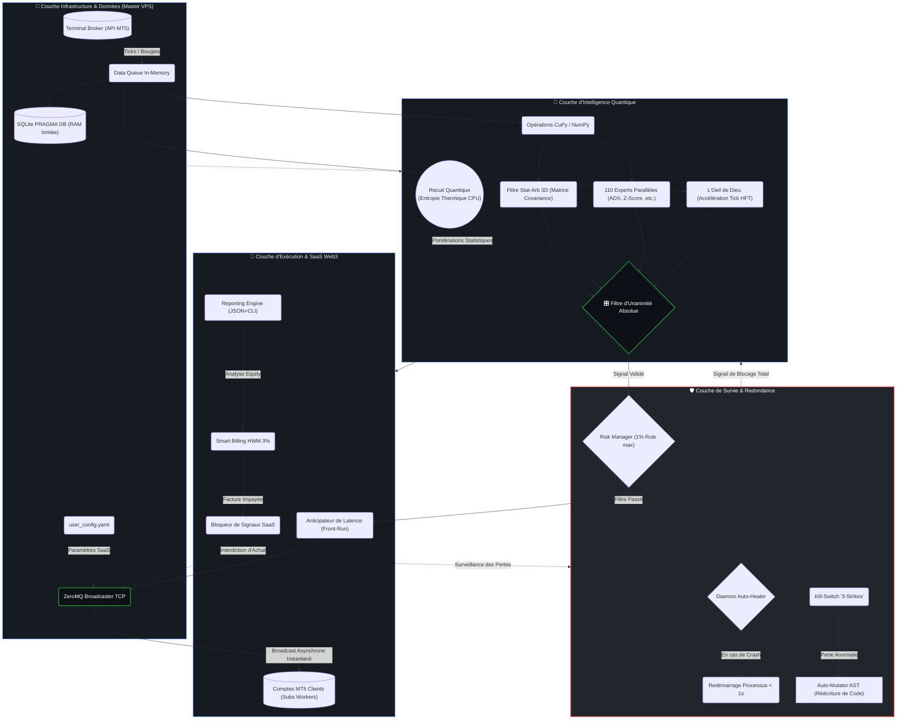
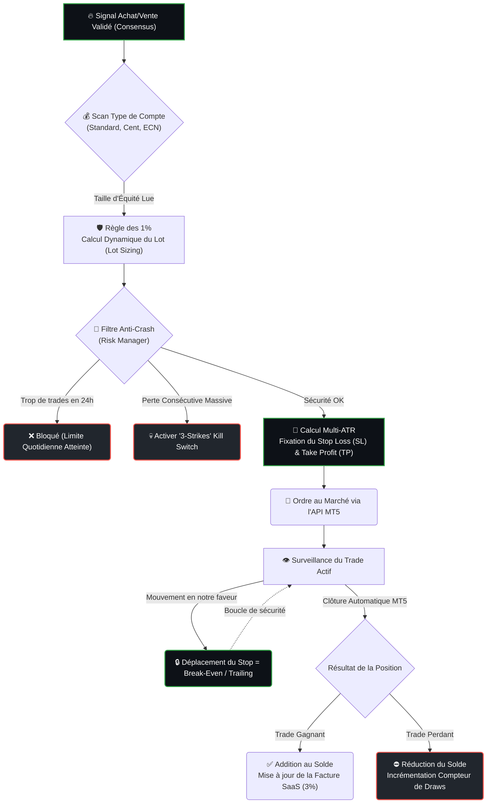
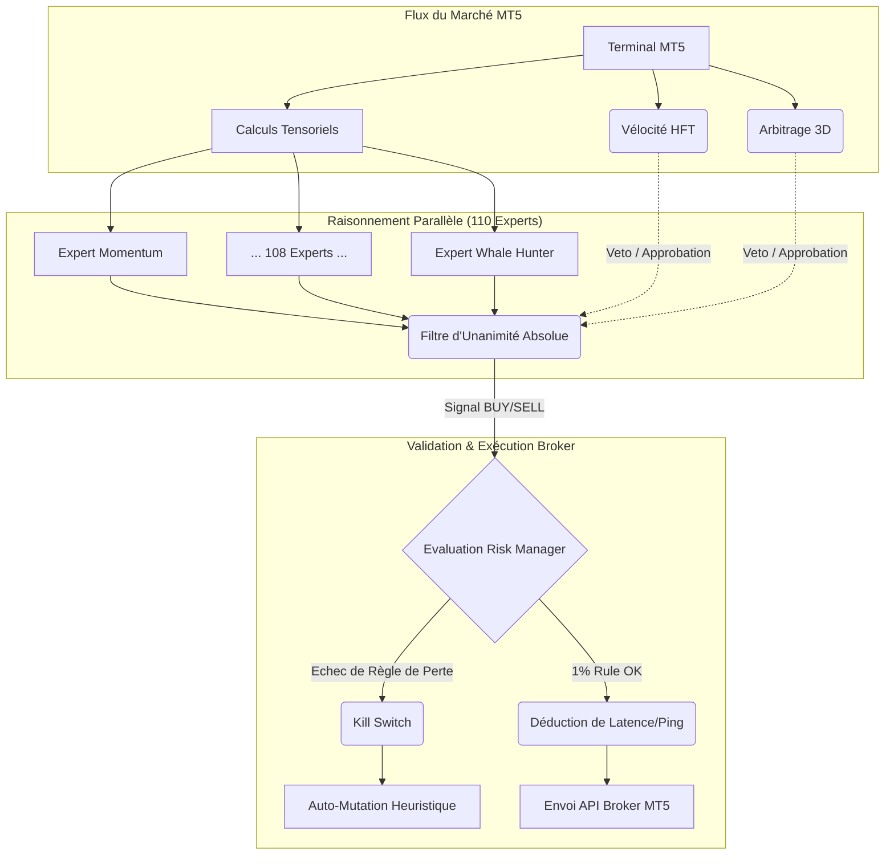
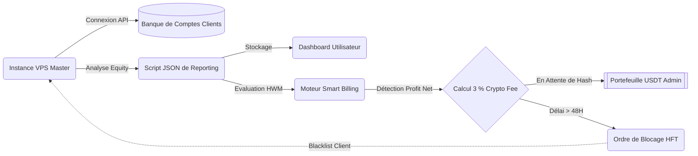
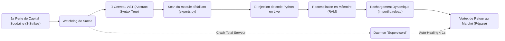

# 🌪️ SOVEREIGN TENSOR-VORTEX

*The  Mathematical Trading Titan.*

---

## 🚀 Qu'est-ce que Tensor-Vortex ?

**Sovereign Tensor-Vortex v3.0** est un moteur de trading quantitatif haute-fréquence conçu pour MetaTrader 5, bâti de A à Z selon les standards technologiques algorithmiques de la Silicon Valley.

Chaque ligne de code, de l'architecture réseau (*ZeroMQ*) jusqu'au moteur de parsing mathématique de la mémoire RAM, est conçue pour purger l'émotion humaine des marchés financiers. 

Le système repose sur un constat central : **L'extraction de données HFT + L'Unanimité de 110 Stratégies > Sentiment Humain.** Au lieu de se fier à des indicateurs retardés isolés, chaque tick de marché traverse un pipeline composé de 110 agents experts qui procèdent à un vote d'unanimité absolue avant d'autoriser l'exécution d'un trade.

### Matrice des Technologies et Composants IA

| Composant de l'IA | Technologie Logicielle & Framework | Rôle Spécifique dans le Système |
|---|---|---|
| **L'Oeil de Dieu (HFT)** | `pandas`, `numpy` (Vectorisation) | Analyse des Ticks à la milliseconde pour calculer l'accélération du prix ($dp^2/dt^2$). |
| **Cerveau Quantitatif (110 Experts)** | Algorithmique Discrète (Maths Pures) | Exécution parallèle de 110 modèles quantitatifs (Momentum, Z-Score, ADX, Fractals). |
| **Moteur de Consensus (Unanimité)** | `CuPy` (CUDA GPU Accelerateur) | Matrices de calcul tensoriel ultra-rapides pour obliger l'unanimité des stratégies. |
| **Filtre Stat-Arb 3D** | Algèbre Linéaire (Matrice Covariance) | Arbitrage triangulaire entre les paires de devises pour neutraliser le risque global d'exposition. |
| **Recuit Quantique (QEA)** | Entropie Thermique CPU (Aléatoire) | Optimisation heuristique des pondérations des modèles pour échapper aux minimums locaux. |
| **Parseur d'Auto-Mutation** | `ast` (Arbre Syntaxique Abstrait Python) | Modifier et recompiler le script de l'intelligence artificielle en direct dans la mémoire RAM. |
| **Réseau Master/Worker (Broadcaster)** | `ZeroMQ` (Architecture TCP Pub-Sub) | Transmission asynchrone des ordres d'achat/vente du VPS Master vers 1 Million de "Workers" clients. |
| **Smart-Billing SaaS (Web3)** | Système Hedge-Fund *High-Water Mark* | Facturation algorithmique automatique des utilisateurs SaaS pour 3% de frais sur leurs profits cryptos nets. |
| **Moteur de Survie (Auto-Healing)** | Daemon OS Local, SQLite `In-Memory` | Watchdog absolu. Redémarre l'IA en moins d'une seconde en cas de plantage et limite la RAM totale à < 2 Go. |

### 📂 Structure du Projet

```bash
tensor-vortex/                             # Racine du projet
├── ai/                                    # Cerveau & Intelligence Artificielle
│   ├── brain.py                           # Auto-Correction & IA d'ajustement
│   ├── dark_pool.py                       # Détection des ordres institutionnels
│   ├── neuro_filter.py                    # Filtres mathématiques profonds
│   ├── quantum_annealer.py                # Optimiseur thermodynamique (QEA)
│   ├── stat_arb.py                        # Arbitrage statistique 3D
│   └── topology_predictor.py              # Prédiction de volatilité graphique
├── bot/                                   # Logique Trading & Gestion
│   ├── billing_manager.py                 # Système de facturation SaaS Web3
│   ├── db_manager.py                      # Gestion de la base de données locale
│   ├── executor.py                        # Interface d'exécution MT5
│   ├── experts.py                         # Catalogue des 110 experts quantitatifs
│   ├── quant_engine.py                    # Moteur de consensus principal
│   ├── reporting_engine.py                # Générateur de rapports (JSON/CLI)
│   └── risk_manager.py                    # Gestionnaire de risque & lots
├── core/                                  # Infrastructure & Matériel
│   ├── auto_healer.py                     # Watchdog de survie (Auto-Healing)
│   ├── broadcaster.py                     # Serveur ZeroMQ pour 1M d'utilisateurs
│   ├── gpu_accelerator.py                 # Interface CUDA (CuPy)
│   └── latency_engine.py                  # Prédicteur de latence HFT
├── mutator/                               # Génétique Logique
│   └── dynamic_parser.py                  # Parseur AST pour mutation de code
├── dashboard/                             # Interface Client (Site Web)
├── logs/                                  # Journaux d'exécution
├── scripts/                               # Outils de lancement et tests
│   ├── test_tensor_vortex.py              # Diagnostic système complet
│   └── ultra_light_launch.py              # Lanceur de production headless
├── user_config.yaml                       # Configuration utilisateur centrale
└── README.md                              # Manifeste & Documentation
```

---

## 🧠 Schémas Logiques de l'Architecture

### 0. Cartographie Macro-Globale du Système Tensor-Vortex
Ce schéma représente l'écosystème complet, englobant les 4 couches (Données, Intelligence, Exécution/SaaS, et Survie) en un seul arbre de commandes.



### 1. Gestion du Compte et Exécution des Trades (Order Management)
Ce schéma explique la protection du capital (Risk Management). Une fois qu'un signal d'achat/vente est généré par l'Intelligence Artificielle, le bot calcule mathématiquement la taille de l'ordre, sa limite de perte (SL) et sécurise automatiquement la position ouverte avec le *Break-Even* ou le *Trailing Stop*.



### 2. Processus Computationnel et d'Exécution (Détail Inférence)
Ce schéma détaille le traitement milliseconde par milliseconde des données de marché.



### 2. Algorithme de Smart-Billing Web3 (Modèle SaaS)
Ce schéma indique comment l'IA prélève ses frais administratifs (3%) sur les clients connectés.


### 3. L'Oeil de Dieu : Le Moteur Haute-Fréquence HFT (Micro-Structure)
Ce schéma isole la logique milliseconde de notre algorithme HFT, capable de détecter les retournements de prix et les Dark Pools avant que la bougie M1 ne se clôture.

```mermaid
flowchart TD
    Tick["📡 Flux de Ticks (Asynchrone)"] --> StreamQueue(File d'attente Tick Buffer)
    StreamQueue --> Derivate1{"📈 Dérivée d(Price)"}
    StreamQueue --> Derivate2{"🚀 Dérivée d²(Price)"}
    
    Derivate1 -->|Calcul Vélocité : v(t)| Calc(Moteur de Calcul C++ / CuPy)
    Derivate2 -->|Calcul Accélération : a(t)| Calc
    
    Calc --> Eval{Évaluation Vectorielle}
    Eval -->|v(t) > 0 & a(t) < 0| Exhaustion((Alerte d'Épuisement))
    Eval -->|v(t) < 0 & a(t) > 0| Spring((Alerte de Rebond))
    Eval -->|v(t) Constant| Noise(Traitement comme Bruit)
    
    Exhaustion --> Signal(Signal Vente Anti-Mouton)
    Spring --> Signal(Signal Achat Fond de Panier)
    Signal --> ConsensusEngine[[Envoi au Filtre d'Unanimité]]
```

### 4. Le Cycle de Survie : Auto-Healing et Mutation Génétique
Ce schéma présente le concept "Survivor" de Tensor-Vortex : l'IA est capable de se recoder en pleine exécution (Parsing AST) pour échapper à des drawdowns catastrophiques inattendus.



---

## 🧮 Moteur Mathématique : Formules Intégrées

Contrairement aux bots traditionnels, Tensor-Vortex base toutes ses décisions sur une logique mathématique pure. Voici les équations exactes codées dans le système (via `NumPy` et `CuPy`), séparées par composants de marché.

### A. Composante Haute Fréquence (Oeil de Dieu)
L'analyse HFT se fonde sur la cinématique des prix. Plutôt que de regarder la position $p_t$, l'IA évalue ses dérivées.
- **Vélocité (Élan du Prix) :**
  $$v(t) = \frac{p(t) - p(t-1)}{\Delta t}$$
- **Accélération (Épuisement du Momentum) :**
  $$a(t) = \frac{v(t) - v(t-1)}{\Delta t}$$
> **Logique d'exécution :** Si le prix monte ($v(t) > 0$) mais que son accélération s'effondre ($a(t) < 0$), l'unanimité bloque l'achat car le mouvement est une manipulation.

### B. Composante Statistique (Arbitrage & Retour)
Utilisée pour identifier les excursions irrationnelles du marché hors de la courbe de Gauss standard.
- **Z-Score Normalisé :**
  $$Z_t = \frac{p_t - \mu_{window}}{\sigma_{window}}$$
- **Convergence MACD (Moving Average Convergence Divergence) :**
  $$MACD_{Line} = EMA_{fast}(p) - EMA_{slow}(p)$$
  $$Signal_{Line} = EMA_{signal}(MACD_{Line})$$
  $$Histogram = MACD_{Line} - Signal_{Line}$$

### C. Composante d'Action de Prix (Momentum Absolu)
L'indicateur ADX (Average Directional Index) est vectorisé pour déterminer mathématiquement la pureté d'une tendance.
- **True Range (TR) :**
  $$TR_t = \max(H_t - L_t, \ |H_t - C_{t-1}|, \ |L_t - C_{t-1}|)$$
- **Directional Movement (+DM / -DM) :**
  $$\text{Si } (H_t - H_{t-1}) > (L_{t-1} - L_t) \Rightarrow +DM = H_t - H_{t-1}$$
  $$\text{Si } (L_{t-1} - L_t) > (H_t - H_{t-1}) \Rightarrow -DM = L_{t-1} - L_t$$
- **ADX Computé :**
  $$ADX = 100 \times EMA \left( \frac{|+DI - -DI|}{+DI + -DI} \right)$$
> **Logique d'exécution :** Seul un ADX > 25 couplé à une vélocité positive validera les Experts de tendance forte.

---

## ⚙️ Configuration Avancée (`user_config.yaml`)

Le fichier `user_config.yaml` est le panneau de contrôle de l'IA. Voici le détail des paramètres :

| Section | Paramètre | Description |
|---|---|---|
| `account` | `login` | ID de votre compte MetaTrader 5. |
| `account` | `password` | Mot de passe de votre compte (recommandé via ENV). |
| `account` | `server` | Nom du serveur broker (ex: `XMGlobal-MT5-4`). |
| `billing` | `admin_accounts` | Liste des comptes exemptés de la taxe de 3%. |
| `billing` | `fee_percentage` | Pourcentage prélevé sur les bénéfices (défaut: `0.03`). |
| `billing` | `crypto_wallet` | Adresse de réception des paiements USDT/USDC. |
| `trading` | `markets` | Liste des paires à surveiller (ex: `['EURUSD', 'XAUUSD']`). |
| `trading` | `risk_per_trade`| Pourcentage du capital risqué par trade (max `0.01`). |
| `hardware`| `force_cpu` | `True` pour ignorer le GPU même si présent. |

---

## 💻 Manuel d'Opérations : Commandes CLI

L'administration de Tensor-Vortex sur un VPS est entièrement textuelle pour économiser la mémoire (Mode Headless). 

### Lexique des Commandes de Déploiement

| Commande Bash | Description et Utilisation |
|---|---|
| `git clone [url]` | Importe le dépôt Tensor-Vortex sur le serveur VPS hôte. |
| `python -m venv venv` | Isoler l'espace de travail. Crée un environnement virtuel sécurisé pour empêcher les conflits avec le système d'exploitation Windows/Linux. |
| `pip install -r requirements.txt`| Télécharge et compile les paquets mathématiques lourds (`pandas`, `numpy`, bibliothèques ZMQ, etc.) requis par l'IA. |
| `python scripts/test_tensor_vortex.py` | **Commande de Diagnostic.** À lancer obligatoirement avant le trading réel. Vérifie si le VPS possède un GPU Nvidia pour `CuPy`, teste la compilation des AST et valide les 110 stratégies. |
| `python scripts/ultra_light_launch.py` | **Lancement en Production.** Active le bot en mode Headless (sans écran lourd MT5). Démarre l'Oeil de Dieu et la boucle SaaS de facturation à 3%. *C'est le bouton ON.* |
| `cat logs/ultra_light.log` | **Rapport d'Activité.** Parcourt le fichier journal d'exécution. Visualise les "Signal Confidance" et les trades bloqués par le Kill Switch en temps réel. |
| `cat dashboard/public/api_report.json` | **Rapport Financier JSON.** Affiche l'export chronologique des données de gains, de Win Rate et des requêtes SaaS (le fichier mangé par le frontend Web). |

### Guides d'Initialisation par Système d'Exploitation (OS)

Pour amorcer le système sur une machine fraîchement formatée, suivez la procédure correspondant à votre système.

#### A. Guide Windows (PowerShell) - Environnement Typique
La plupart des clients et des serveurs VPS MT5 standards tournent sous Windows Server. Lancez **PowerShell en mode Administrateur**.

```powershell
# 1. Cloner le Projet
git clone https://github.com/votre_nom/tensor-vortex.git
cd tensor-vortex

# 2. Création et activation de l'Environnement Virtuel (Isolation)
python -m venv venv
Set-ExecutionPolicy Unrestricted -Scope CurrentUser # Autoriser l'exécution de scripts
.\venv\Scripts\Activate.ps1

# 3. Installation des Frameworks IA et Mathématiques
pip install -r requirements.txt

# 4. Certification et Test Hardware
python scripts/test_tensor_vortex.py

# 5. Allumage du Bot en arrière-plan
# Le processus tournera, mais PowerShell restera utilisable
Start-Process -NoNewWindow -FilePath "python" -ArgumentList "scripts/ultra_light_launch.py"
```

#### B. Guide Linux (Bash Terminal - Serveurs VPS HFT)
Les serveurs haute fréquence performants (Kali Linux, Ubuntu) nécessitent une exécution via `Wine` (pour MetaTrader 5) mais le script Python s'exécute nativement. 

```bash
# 1. Cloner le Projet et MàJ du système
sudo apt update && sudo apt install python3.11-venv git -y
git clone https://github.com/votre_nom/tensor-vortex.git
cd tensor-vortex

# 2. Création et activation du VENV
python3 -m venv venv
source venv/bin/activate

# 3. Installation du moteur (CuPy pour GPU Linux)
pip install -r requirements.txt

# 4. Diagnostic Terminal
python3 scripts/test_tensor_vortex.py

# 5. Décollage Production (Mode Detached)
# Utiliser 'nohup' pour que l'IA continue de trader même si vous fermez le terminal SSH
nohup python3 scripts/ultra_light_launch.py > logs/master_tensor.log 2>&1 &

# Pour vérifier en direct que l'IA tourne :
tail -f logs/master_tensor.log
```

> **Alerte Déploiement :** Dans les deux cas (Windows ou Linux), modifiez le fichier `user_config.yaml` avant l'allumage final (`Étape 5`) pour intégrer vos clés d'admin (bypasser les frais de 3%).

---

## 🛠️ Mode Débogage & Maintenance

Si l'IA ne se lance pas ou si les performances divergent, suivez ce protocole :

### 1. Diagnostic Materiel & Logiciel
Exécutez toujours le script de test avant de chercher plus loin. Il isolera les problèmes de GPU, de permissions MT5 ou de bibliothèques manquantes.
```bash
python scripts/test_tensor_vortex.py
```

### 2. Analyse des Journaux (Logs)
Le dossier `logs/` contient la mémoire de l'IA :
- `master_tensor.log` : Contient chaque signal généré et la raison (Confiance, Veto HFT, etc.).
- `mt5_errors.log` : Répertorie les erreurs de connexion au serveur du broker.

### 3. Problèmes Communs
- **"MT5 Connection Failed"** : Vérifiez que le terminal MT5 est installé et que le chemin dans `user_config.yaml` est correct.
- **"CUDA Error"** : Votre GPU n'est pas compatible ou les drivers Nvidia sont absents. Activez `force_cpu: True` dans la config.
- **"Permission Denied"** : Lancez votre terminal (PowerShell ou Bash) avec des privilèges administrateur/sudo.

---

## ⚠️ Avertissement Légal & Raisonnement (Disclaimer)

**Tensor-Vortex v3.0** est un outil de recherche quantitative et d'analyse algorithmique. Bien que le bot soit conçu via des modèles mathématiques de niveau institutionnel (HFT, Recuit Quantique, Stat-Arb), les marchés financiers demeurent fondamentalement chaotiques et imprévisibles.

- **Absence de Certitude Algorithmique :** Les performances passées, simulées ou backtestées par cette matrice mathématique ne garantissent en rien la rentabilité future.
- **Risque Critique de Perte en Capital :** Le système traite les devises globales (Forex, CFD). La spéculation comporte des dangers absolus, pouvant entraîner la vaporisation totale d'un compte (Marging Call), en particulier lors de chocs systémiques imprévus.
- **Principe de Survie Financière :** La technologie HFT ne doit constituer en rien un système de rente acquise. Dépensez et allouez votre capital de manière **responsable**. N'investissez jamais l'argent destiné à votre stabilité vitale. Testez impérativement chaque configuration sur un compte Démo, durant plusieurs semaines de volatilités variées.
- **Décharge Totale de Responsabilité :** Le Créateur Originel ("Chico" / Développeurs), ainsi que toute personne modifiant ce code source (*Fork*), déclinent officiellement toute forme explicite ou implicite de responsabilité vis-à-vis des éventuelles pertes financières, dommages collatéraux ou conséquences de l'utilisation de Tensor-Vortex. Le logiciel est proposé "tel quel", comme un dispositif éducatif et informatique mathématique brut.
- En exécutant `ultra_light_launch.py`, l'Opérateur (Vous) acccepte ces termes et certifie en assumer l'entière, stricte et exclusive responsabilité vis-à-vis du code, du broker et des régulateurs mondiaux.

---

> _"Dans les marchés contemporains, la latence est fatale, et le sentiment crée le bruit. Seules les mathématiques subsistent."_  
**— Commandant Chico**
